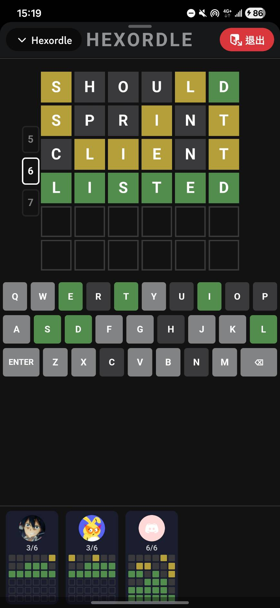
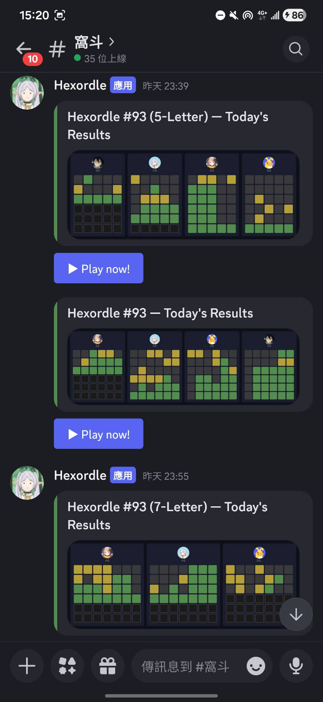

# Hexordle

A multiplayer Wordle variant built as a **Discord Embedded Activity** — playable directly inside a Discord voice or text channel. Supports 5, 6, and 7-letter modes, real-time spectating, and daily per-mode leaderboard images posted automatically to your server.

> This repository is for reference and self-hosting. The live instance is private and runs inside a specific Discord server.

---

## Screenshots

<div align="center">
  
  &nbsp;&nbsp;&nbsp;
  
</div>

---

## Features

- **Three word-length modes** — 5, 6, or 7 letters, each with an independent daily word and progress
- **Real-time multiplayer** — spectate other players' boards live via WebSocket as they guess
- **Daily leaderboard** — bot automatically posts (and updates) a progress image to a designated channel after each player finishes; separate message per mode
- **Cross-device sync** — game state is persisted server-side, so progress is restored if you reopen the Activity
- **Midnight auto-reset** — detects date change via polling + `visibilitychange` and resets to the new day's word without needing a refresh
- **Fluid responsive layout** — tiles scale to fit any Discord Activity panel size using CSS `clamp()` and a `ResizeObserver`

---

## How to Play

1. Open the Activity inside Discord (via a voice channel or the app launcher)
2. Use the **5 / 6 / 7** tabs on the left to choose a word length
3. Type a word and press **Enter** to submit — 6 attempts per mode
4. Tile colors after each guess:
   - **Green** — correct letter, correct position
   - **Yellow** — correct letter, wrong position
   - **Dark** — letter not in the word
5. The word resets daily at midnight (local time)
6. The spectator panel at the bottom shows today's results from other server members

---

## Tech Stack

| Layer | Technology |
|---|---|
| Frontend | React + TypeScript + Vite |
| Backend | Node.js + Express |
| Realtime | WebSocket (ws) |
| Database | PostgreSQL |
| Image generation | `@napi-rs/canvas` |
| Platform | Discord Activities SDK |
| Hosting | Railway |

---

## Self-Hosting

### Prerequisites

- A [Discord Developer Application](https://discord.com/developers/applications) with:
  - Activities enabled (URL Mapping configured)
  - A Bot added to the application
- A PostgreSQL database (Railway, Supabase, Neon, etc.)
- Node.js 18+

### Environment Variables

Create a `.env` file at the project root (see `.gitignore` — this file is never committed):

```env
VITE_CLIENT_ID=      # Discord Application / Client ID
CLIENT_SECRET=       # Discord OAuth2 Client Secret
BOT_TOKEN=           # Discord Bot Token
DATABASE_URL=        # PostgreSQL connection string (set in Railway env, not .env)
```

> `DATABASE_URL` is typically injected by Railway automatically when you add a Postgres plugin. For local development you can add it to `.env`.

### Local Development

```bash
# Install dependencies
npm install

# Start client (Vite dev server) and server concurrently
npm run dev
```

The client runs on `http://localhost:5173` and proxies API calls to the server on port `3000`.

Discord Activities must be served via HTTPS and through Discord's proxy, so full end-to-end testing requires your app to be registered with Discord and tunnelled (e.g. with [cloudflared](https://developers.cloudflare.com/cloudflare-one/connections/connect-networks/downloads/)).

### Production Build & Deploy (Railway)

```bash
# Build client static assets
npm run build

# Start server (serves built client + API)
npm start
```

Railway deployment steps:
1. Connect your GitHub repo to a new Railway project
2. Add a **PostgreSQL** plugin — `DATABASE_URL` is injected automatically
3. Set the remaining environment variables (`VITE_CLIENT_ID`, `CLIENT_SECRET`, `BOT_TOKEN`) in Railway's Variables tab
4. The server runs `npm start` on deploy; database migrations run automatically on first boot

### Discord Application Setup

1. In the [Developer Portal](https://discord.com/developers/applications), create a new application
2. Under **Activities → URL Mappings**, add a mapping pointing to your Railway domain
3. Under **Bot**, enable the bot and copy the token into `BOT_TOKEN`
4. Invite the bot to your server with `applications.commands` and `bot` scopes
5. Run `/hexordle` in your server to launch the Activity

The bot will automatically post daily result messages to a channel named `窩斗` (or fall back to the first available text channel).

---

## Project Structure

```
packages/
  client/          # React frontend (Discord Activity iframe)
    src/
      components/  # Board, Keyboard, SpectatorPanel, ResultModal, …
      hooks/       # useGameState, useMultiplayer, useDateCheck, …
      lib/         # Word lists, evaluation logic, share text
  server/          # Express backend
    src/
      app.js       # API routes, WebSocket, DB migrations, Discord bot
```
